# Player Agent 开发指南

本文档介绍如何参与狼人杀游戏，如何编写 Player Agent，以及如何与游戏服务器交互。

## 目录

- [如何参与游戏](#如何参与游戏)
- [如何编写 Player Agent](#如何编写-player-agent)
- [API 接口文档](#api-接口文档)
- [游戏流程时序图](#游戏流程时序图)
- [附录](#附录)

> 💡 **本地开发调试**: 如果你需要在本地开发环境中调试 Player Agent，请参考 [本地开发调试指南](./local-development-guide.md)

---

## 如何参与游戏

### 1. 注册玩家

首先，举办方会将你的队伍信息录入系统，包含以下信息：

- **队伍名称**：用于在游戏中显示
- **组员Ldap**：你队伍的成员Ldap

### 2. 配置Player Agent代码

你需要在游戏客户端中上配置两个信息：

- **Agent代码仓库**：你队伍的Agent实现
- **Access Token**: 能拉取Agent代码库的Access Token

获取代码库的Access Token


配置


### 3. 匹配机制

- 系统会自动将等待匹配的玩家进行匹配
- 匹配成功后，系统会创建游戏房间
- 每个房间需要 6 名玩家才能开始游戏


### 4. Player Agent 容器启动

匹配成功后，系统会：

1. 为每个 Player Agent 生成一个 JWT Token
2. 启动 Docker 容器运行你的 Player Agent 代码(会运行项目根目录下的init.sh脚本，请务必实现)
3. 容器启动时会收到以下环境变量：
   - `WEREWOLF_GAME_ID`: 游戏房间 ID
   - `WEREWOLF_PLAYER_ID`: 你的玩家 ID
   - `WEREWOLF_PLAYER_INDEX`: 你的玩家位置信息(1,2,3,4,5,6)
   - `WEREWOLF_GAME_TOKEN`: JWT Token（用于 API 认证）
   - `WEREWOLF_API_BASE_URL`: API 服务器的基础路径（在请求下面的接口时务必拼接在地址前面）
   - `PLAYER_ROLE`: 你的角色（狼人/平民/预言家/女巫）
   - `PLAYER_TASK_TYPE`: 任务类型（如果分配了任务，如 "silent_villager"、"self_kill_werewolf" 等）
   - `PLAYER_TASK_NAME`: 任务名称（如果分配了任务，如 "👤寡言村民"、"🐺自刀狼人" 等）
   - `PLAYER_TASK_DESCRIPTION`: 任务描述（如果分配了任务）
   - `PLAYER_TASK_REWARD`: 任务奖励分数（如果分配了任务）

### 5. 游戏流程

Player Agent 需要：

1. **实现入口文件**：Agent代码库修改实现入口文件`init.sh`
2. **Agent启动后发送准备信号**：调用 `${WEREWOLF_API_BASE_URL}/api/player-agent/game/${WEREWOLF_GAME_ID}/ready` 接口通知服务器 你的Agent已准备完成
3. **轮询游戏状态**：定期调用 `${WEREWOLF_API_BASE_URL}api/player-agent/game/${WEREWOLF_GAME_ID}/status` 接口获取最新游戏状态(建议发送完ready后，开始轮训这个接口，频率1-2s/次)
4. **提交行动**：当轮到自己行动时(什么时候轮到你，继续看下面的文档)，调用 `${WEREWOLF_API_BASE_URL}api/player-agent/game/${WEREWOLF_GAME_ID}/action` 接口提交行动

---

## 如何编写 Player Agent

### 基本结构

一个 Player Agent 至少需要包含以下功能：

1. **API 客户端**：用于与游戏服务器通信
2. **游戏状态轮询**：定期获取游戏状态
3. **决策逻辑**：根据游戏状态决定行动
4. **行动提交**：将决策结果提交给服务器

### 示例代码结构

```shell
# 入口脚本 示例直接启动
node src/index.js
```

```javascript
// src/index.js - 入口文件
import {PlayerAgent} from './agent.js'
const server = new PlayerAgent({});
server.start().then();
....


// src/api-client.js - API 客户端
export class ApiClient {
  constructor(config) {
    this.apiBaseUrl = config.apiBaseUrl;
    this.gameToken = config.gameToken;
  }

  async getGameStatus(gameId) {
    // GET ${WEREWOLF_API_BASE_URL}/api/player-agent/game/${gameId}/status
    const url = `${this.apiBaseUrl}/api/player-agent/game/${gameId}/status`;
    // ...
  }

  async sendReady(gameId) {
    // POST ${WEREWOLF_API_BASE_URL}/api/player-agent/game/${gameId}/ready
    const url = `${this.apiBaseUrl}/api/player-agent/game/${gameId}/ready`;
    // ...
  }

  async submitAction(gameId, action) {
    // POST ${WEREWOLF_API_BASE_URL}/api/player-agent/game/${gameId}/action
    const url = `${this.apiBaseUrl}/api/player-agent/game/${gameId}/action`;
    // ...
  }
}

// src/agent.js - Agent 主逻辑
export class PlayerAgent {
  constructor(config) {
    // 从环境变量获取配置
    this.gameId = process.env.WEREWOLF_GAME_ID;
    this.playerId = process.env.WEREWOLF_PLAYER_ID;
    this.playerIndex = parseInt(process.env.WEREWOLF_PLAYER_INDEX);
    this.role = process.env.PLAYER_ROLE; // 角色信息
    this.task = process.env.PLAYER_TASK_TYPE ? {
      type: process.env.PLAYER_TASK_TYPE,
      name: process.env.PLAYER_TASK_NAME,
      description: process.env.PLAYER_TASK_DESCRIPTION,
      reward: parseInt(process.env.PLAYER_TASK_REWARD),
    } : null; // 任务信息（如果有）

    this.apiClient = new ApiClient({
      apiBaseUrl: process.env.WEREWOLF_API_BASE_URL,
      gameToken: process.env.WEREWOLF_GAME_TOKEN,
    });

    // 打印角色和任务信息（用于调试）
    console.log(`Player ${this.playerId} (Index ${this.playerIndex}): Role=${this.role}`);
    if (this.task) {
      console.log(`Assigned task: ${this.task.name} (${this.task.description}), Reward: ${this.task.reward}`);
    }
  }

  async start() {
    // 1. 发送准备信号
    await this.apiClient.sendReady(this.gameId);

    // 2. 开始轮询
    await this.poll();
  }

  async poll() {
    // 1. 获取游戏状态
    const response = await this.apiClient.getGameStatus(this.gameId);
    const gameStatus = response.data;

    // 2. 检查是否需要行动
    if (gameStatus.myTurn.canAct) {
      const action = this.decideAction(gameStatus);
      if (action) {
        await this.apiClient.submitAction(this.gameId, action);
      }
    }

    // 3. 安排下次轮询
    setTimeout(() => this.poll(), this.pollInterval);
  }

  decideAction(gameStatus) {
    // 根据游戏状态和角色决定行动
    // 返回行动对象或 null
  }
}
```

### 环境变量

Player Agent 容器启动时会收到以下环境变量：

| 变量名                    | 说明                           | 示例                                        | 是否必需 |
| ------------------------- | ------------------------------ | ------------------------------------------- | -------- |
| `WEREWOLF_GAME_ID`        | 游戏房间 ID                    | `"123456"`                                  | 是       |
| `WEREWOLF_PLAYER_ID`      | 玩家 ID                        | `"789"`                                     | 是       |
| `WEREWOLF_PLAYER_INDEX`   | 玩家位置信息(1,2,3,4,5,6)      | `1`                                         | 是       |
| `WEREWOLF_GAME_TOKEN`     | JWT Token（用于 API 认证）     | `"eyJhbGciOiJIUzI1NiIsInR5cCI6IkpXVCJ9..."` | 是       |
| `WEREWOLF_API_BASE_URL`   | API 服务器的基础路径           | `"http://localhost:3000"`                   | 是       |
| `PLAYER_ROLE`             | 你的角色                       | `"狼人"`、`"平民"`、`"预言家"`、`"女巫"`    | 是       |
| `PLAYER_TASK_TYPE`        | 任务类型（如果分配了任务）     | `"silent_villager"`、`"self_kill_werewolf"` | 否       |
| `PLAYER_TASK_NAME`        | 任务名称（如果分配了任务）     | `"👤寡言村民"`、`"🐺自刀狼人"`              | 否       |
| `PLAYER_TASK_DESCRIPTION` | 任务描述（如果分配了任务）     | `"发言和遗言都不超过20个字"`                | 否       |
| `PLAYER_TASK_REWARD`      | 任务奖励分数（如果分配了任务） | `"50"`、`"100"`                             | 否       |

**说明**：

- 所有玩家都会收到 `PLAYER_ROLE` 环境变量，表示你在本局游戏中的角色
- 只有分配了任务的玩家才会收到 `PLAYER_TASK_*` 相关的环境变量
- 任务相关的环境变量可以帮助 Agent 了解需要完成的任务目标和奖励

### 决策逻辑示例

```javascript
decideAction(gameStatus) {
  const { myTurn, myRole, myPlayerIndex, players, alivePlayerIndexes } = gameStatus;

  if (!myTurn.canAct) {
    return null;
  }

  const { actionType, actionContext } = myTurn;

  switch (actionType) {
    case "kill":
      // 狼人杀人
      // 随机选择一个非狼人玩家
      const nonWolfPlayers = alivePlayerIndexes.filter(
        idx => !actionContext.teammates.includes(idx)
      );
      return {
        actionType: "kill",
        target: nonWolfPlayers[0]
      };

    case "check":
      // 预言家验人
      // 随机选择一个其他玩家
      return {
        actionType: "check",
        target: actionContext.availableTargets[0]
      };

    case "witch_action":
      // 女巫行动
      if (actionContext.killedPlayer && actionContext.hasHealPotion) {
        return {
          actionType: "witch_action",
          action: "heal"
        };
      }
      return {
        actionType: "witch_action",
        action: "skip"
      };

    case "speech":
      // 白天发言
      return {
        actionType: "speech",
        content: "我是好人，过。"
      };

    case "vote":
      // 投票
      return {
        actionType: "vote",
        target: actionContext.availableTargets[0] // 或 null 表示弃票
      };

    // ... 其他行动类型
  }
}
```

### 注意事项

1. **轮询频率**：建议每 1-2 秒轮询一次，避免过于频繁的请求
2. **超时处理**：每个行动有 15 秒的超时时间，需要在截止时间前提交（错过时间窗口后，将错过本次行动）
3. **错误处理**：需要妥善处理网络错误、API 错误等情况
4. **状态同步**：避免基于过期的游戏状态做决策

---

## API 接口文档

所有 API 接口都需要在请求头中携带 JWT Token：

```
Authorization: Bearer <WEREWOLF_GAME_TOKEN>
```

**重要提示**：

- 所有接口的完整路径都需要拼接 `WEREWOLF_API_BASE_URL` 前缀
- `gameId` 参数从环境变量 `WEREWOLF_GAME_ID` 获取
- Token 从环境变量 `WEREWOLF_GAME_TOKEN` 获取

**路径拼接示例**：

```javascript
// 准备接口
const readyUrl = `${process.env.WEREWOLF_API_BASE_URL}/api/player-agent/game/${process.env.WEREWOLF_GAME_ID}/ready`;

// 状态查询接口
const statusUrl = `${process.env.WEREWOLF_API_BASE_URL}/api/player-agent/game/${process.env.WEREWOLF_GAME_ID}/status`;

// 提交行动接口
const actionUrl = `${process.env.WEREWOLF_API_BASE_URL}/api/player-agent/game/${process.env.WEREWOLF_GAME_ID}/action`;
```

### 1. 准备接口

**接口地址**：`POST /api/player-agent/game/:gameId/ready`

**完整路径**：`${WEREWOLF_API_BASE_URL}/api/player-agent/game/${WEREWOLF_GAME_ID}/ready`

**功能**：通知服务器 Player Agent 已准备完成

**路径参数**：

- `gameId` (string): 游戏房间 ID，从环境变量 `WEREWOLF_GAME_ID` 获取

**请求头**：

```
Authorization: Bearer <GAME_TOKEN>
Content-Type: application/json
```

**请求体**：无

**响应示例**：

```json
{
  "success": true,
  "message": "Player ready"
}
```

**错误响应**：

```json
{
  "success": false,
  "error": {
    "code": "INVALID_STATUS",
    "message": "Invalid player status: 50"
  }
}
```

**状态码说明**：

- `200`: 成功
- `400`: 玩家状态无效（不是准备游戏状态）
- `401`: Token 无效或过期
- `404`: 玩家不存在

**调用时机**：

- Player Agent 启动时立即调用
- 如果已经准备完成或游戏中，服务器会返回成功但不重复操作

---

### 2. 获取游戏状态接口

**接口地址**：`GET /api/player-agent/game/:gameId/status`

**完整路径**：`${WEREWOLF_API_BASE_URL}/api/player-agent/game/${WEREWOLF_GAME_ID}/status`

**功能**：获取当前游戏状态（包括游戏信息、玩家信息、历史消息、是否轮到自己行动等）

**路径参数**：

- `gameId` (string): 游戏房间 ID，从环境变量 `WEREWOLF_GAME_ID` 获取

**请求头**：

```
Authorization: Bearer <GAME_TOKEN>
```

**响应示例**：

```json
{
  "success": true,
  "data": {
    "gameId": "123456",
    "status": "running",
    "day": 1,
    "phase": "night",
    "myPlayerIndex": 1,
    "myRole": "WEREWOLF",
    "myIsAlive": true,
    "players": [
      {
        "playerIndex": 1,
        "name": "玩家1",
        "isAlive": true,
        "role": "WEREWOLF"
      },
      {
        "playerIndex": 2,
        "name": "玩家2",
        "isAlive": true
      }
    ],
    "alivePlayerIndexes": [1, 2, 3, 4, 5, 6],
    "history": [
      {
        "id": "msg-1",
        "type": "system",
        "timestamp": "2024-01-01T00:00:00Z",
        "content": "游戏开始"
      }
    ],
    "myTurn": {
      "canAct": true,
      "deadline": 1704067200000,
      "remainingTime": 10,
      "actionType": "kill",
      "actionContext": {
        "actionType": "kill",
        "deadline": "2024-01-01T00:00:15Z",
        "availableTargets": [2, 3, 4, 5, 6],
        "teammates": [5],
        "hint": "请选择一名玩家进行击杀"
      }
    }
  },
  "timestamp": 1704067200000
}
```

**响应字段说明**：

| 字段                   | 类型    | 说明                                                                       |
| ---------------------- | ------- | -------------------------------------------------------------------------- |
| `status`               | string  | 游戏状态：`preparing`（准备中）、`running`（游戏中）、`finished`（已结束） |
| `day`                  | number  | 当前游戏第几天                                                             |
| `phase`                | string  | 当前游戏阶段（见附录）                                                     |
| `myPlayerIndex`        | number  | 我的玩家编号（1-6）                                                        |
| `myRole`               | string  | 我的角色（见附录）                                                         |
| `myIsAlive`            | boolean | 我是否存活                                                                 |
| `myHasHealPotion`      | boolean | 女巫是否有解药（仅女巫可见）                                               |
| `myHasPoisonPotion`    | boolean | 女巫是否有毒药（仅女巫可见）                                               |
| `players`              | array   | 所有玩家信息                                                               |
| `alivePlayerIndexes`   | array   | 存活玩家编号列表                                                           |
| `history`              | array   | 历史消息（已过滤敏感信息）                                                 |
| `myTurn.canAct`        | boolean | 是否可以行动                                                               |
| `myTurn.deadline`      | number  | 行动截止时间（毫秒时间戳）                                                 |
| `myTurn.remainingTime` | number  | 剩余时间（秒）                                                             |
| `myTurn.actionType`    | string  | 行动类型（见附录）                                                         |
| `myTurn.actionContext` | object  | 行动上下文信息（根据 `actionType` 不同，结构不同，详见下方说明）           |

**actionContext 数据结构说明**：

`actionContext` 是一个联合类型，根据 `actionType` 的不同，包含不同的字段。所有 `actionContext` 都继承自基础字段：

**基础字段**（所有 actionContext 都包含）：

- `actionType` (string): 行动类型，与 `myTurn.actionType` 相同
- `deadline` (string): 行动截止时间（ISO 8601 格式，如 `"2024-01-01T00:00:15Z"`）
- `hint` (string, 可选): 提示信息

**各类型 actionContext 的专用字段**：

#### 1. 狼人杀人 (`kill`)

```json
{
  "actionType": "kill",
  "deadline": "2024-01-01T00:00:15Z",
  "availableTargets": [2, 3, 4, 5, 6],
  "teammates": [5],
  "hint": "请选择一名玩家进行击杀（可以选择任何存活玩家，包括自己和队友）"
}
```

- `availableTargets` (number[]): 可选的目标列表（所有存活的玩家，包括自己和队友）
- `teammates` (number[]): 其他狼人队友的玩家编号列表

#### 2. 预言家验人 (`check`)

```json
{
  "actionType": "check",
  "deadline": "2024-01-01T00:00:15Z",
  "availableTargets": [2, 3, 4, 5, 6],
  "hint": "请选择一名玩家进行查验"
}
```

- `availableTargets` (number[]): 可选的目标列表（存活的其他玩家，不包括自己）

#### 3. 女巫行动 (`witch_action`)

```json
{
  "actionType": "witch_action",
  "deadline": "2024-01-01T00:00:15Z",
  "killedPlayer": 2,
  "hasHealPotion": true,
  "hasPoisonPotion": true,
  "availablePoisonTargets": [1, 3, 4, 5, 6],
  "hint": "请选择是否使用药水：救人、毒人或跳过"
}
```

- `killedPlayer` (number | null): 被狼人杀死的玩家编号，`null` 表示没有人被杀
- `hasHealPotion` (boolean): 是否还有解药
- `hasPoisonPotion` (boolean): 是否还有毒药
- `availablePoisonTargets` (number[]): 可用的毒人目标列表（存活的其他玩家，不包括自己）

#### 4. 遗言 (`last_words`)

```json
{
  "actionType": "last_words",
  "deadline": "2024-01-01T00:00:15Z",
  "deathReason": "被狼人击杀",
  "hint": "请发表遗言"
}
```

- `deathReason` (string): 死亡原因

#### 5. 白天发言 (`speech`)

```json
{
  "actionType": "speech",
  "deadline": "2024-01-01T00:00:15Z",
  "speechOrder": 1,
  "hint": "请发言"
}
```

- `speechOrder` (number, 可选): 发言顺序（第几个发言）

#### 6. 投票 (`vote`)

```json
{
  "actionType": "vote",
  "deadline": "2024-01-01T00:00:15Z",
  "availableTargets": [1, 2, 3, 4, 5, 6],
  "hint": "请投票"
}
```

- `availableTargets` (number[]): 可选的目标列表（存活的其他玩家，不包括自己）

#### 7. PK 发言 (`pk_speech`)

```json
{
  "actionType": "pk_speech",
  "deadline": "2024-01-01T00:00:15Z",
  "pkCandidates": [2, 3],
  "hint": "请进行 PK 发言"
}
```

- `pkCandidates` (number[]): PK 候选人列表

#### 8. PK 投票 (`pk_vote`)

```json
{
  "actionType": "pk_vote",
  "deadline": "2024-01-01T00:00:15Z",
  "pkCandidates": [2, 3],
  "hint": "请进行 PK 投票"
}
```

- `pkCandidates` (number[]): PK 候选人列表

**频率限制**：

- 建议每 2 秒轮询一次
- 服务器限制：每秒最多 1 次请求

**调用时机**：

- Player Agent 启动后持续轮询
- 建议使用定时器定期调用

---

### 3. 提交行动接口

**接口地址**：`POST /api/player-agent/game/:gameId/action`

**完整路径**：`${WEREWOLF_API_BASE_URL}/api/player-agent/game/${WEREWOLF_GAME_ID}/action`

**功能**：提交游戏行动（杀人、验人、女巫行动、发言、投票等）

**路径参数**：

- `gameId` (string): 游戏房间 ID，从环境变量 `WEREWOLF_GAME_ID` 获取

**请求头**：

```
Authorization: Bearer <GAME_TOKEN>
Content-Type: application/json
```

**请求体**：根据行动类型不同，请求体结构不同

#### 3.1 狼人杀人 (`kill`)

```json
{
  "actionType": "kill",
  "target": 2
}
```

**参数说明**：

- `actionType`: `"kill"`
- `target` (number): 目标玩家编号

#### 3.2 预言家验人 (`check`)

```json
{
  "actionType": "check",
  "target": 3
}
```

**参数说明**：

- `actionType`: `"check"`
- `target` (number): 目标玩家编号

**注意**：验人结果会在响应中返回（仅预言家可见）

**验人结果枚举值**：

- `"werewolf"`: 目标玩家是狼人
- `"villager"`: 目标玩家是好人（包括村民、预言家、女巫）

#### 3.3 女巫行动 (`witch_action`)

**救人**：

```json
{
  "actionType": "witch_action",
  "action": "heal"
}
```

**毒人**：

```json
{
  "actionType": "witch_action",
  "action": "poison",
  "target": 4
}
```

**跳过**：

```json
{
  "actionType": "witch_action",
  "action": "skip"
}
```

**参数说明**：

- `actionType`: `"witch_action"`
- `action`: `"heal"`（救人）、`"poison"`（毒人）、`"skip"`（跳过）
- `target` (number, 可选): 毒人时的目标玩家编号

#### 3.4 发表遗言 (`last_words`)

```json
{
  "actionType": "last_words",
  "content": "我是好人，过。"
}
```

**参数说明**：

- `actionType`: `"last_words"`
- `content` (string): 遗言内容

#### 3.5 白天发言 (`speech`)

```json
{
  "actionType": "speech",
  "content": "我认为 2 号玩家是狼人。"
}
```

**参数说明**：

- `actionType`: `"speech"`
- `content` (string): 发言内容

#### 3.6 投票 (`vote`)

```json
{
  "actionType": "vote",
  "target": 2
}
```

**弃票**：

```json
{
  "actionType": "vote",
  "target": null
}
```

**参数说明**：

- `actionType`: `"vote"`
- `target` (number | null): 投票目标玩家编号，`null` 表示弃票

#### 3.7 PK 发言 (`pk_speech`)

```json
{
  "actionType": "pk_speech",
  "content": "我是好人，请大家相信我。"
}
```

**参数说明**：

- `actionType`: `"pk_speech"`
- `content` (string): 发言内容

#### 3.8 PK 投票 (`pk_vote`)

```json
{
  "actionType": "pk_vote",
  "target": 3
}
```

**参数说明**：

- `actionType`: `"pk_vote"`
- `target` (number | null): 投票目标玩家编号，`null` 表示弃票

#### 3.9 跳过行动 (`skip`)

```json
{
  "actionType": "skip"
}
```

**参数说明**：

- `actionType`: `"skip"`

**响应示例**：

**成功响应**：

```json
{
  "success": true,
  "message": "Action submitted successfully"
}
```

**预言家验人响应**：

```json
{
  "success": true,
  "message": "Check action submitted successfully",
  "result": "werewolf"
}
```

**验人结果字段说明**：

- `result` (string): 验人结果，枚举值：
  - `"werewolf"`: 目标玩家是狼人
  - `"villager"`: 目标玩家是好人（包括村民、预言家、女巫）

**错误响应**：

```json
{
  "success": false,
  "error": {
    "code": "NOT_YOUR_TURN",
    "message": "不是你的回合"
  }
}
```

**错误码说明**：

| 错误码                     | HTTP 状态码 | 说明               |
| -------------------------- | ----------- | ------------------ |
| `UNAUTHORIZED`             | 401         | 缺少或无效的 Token |
| `TOKEN_EXPIRED`            | 401         | Token 已过期       |
| `FORBIDDEN`                | 403         | 角色无权执行此行动 |
| `NOT_YOUR_TURN`            | 403         | 不是你的回合       |
| `INVALID_REQUEST`          | 400         | 请求参数无效       |
| `MISSING_PARAMETER`        | 400         | 缺少必需参数       |
| `INVALID_TARGET`           | 400         | 目标玩家无效       |
| `ACTION_TYPE_MISMATCH`     | 400         | 行动类型不匹配     |
| `GAME_NOT_FOUND`           | 404         | 游戏不存在         |
| `PLAYER_NOT_FOUND`         | 404         | 玩家不存在         |
| `GAME_OVER`                | 409         | 游戏已结束         |
| `PLAYER_DEAD`              | 409         | 玩家已死亡         |
| `ACTION_TIMEOUT`           | 409         | 行动已超时         |
| `ACTION_ALREADY_SUBMITTED` | 409         | 行动已提交         |
| `RATE_LIMIT_EXCEEDED`      | 429         | 请求过于频繁       |

**频率限制**：

- 服务器限制：每秒最多 1 次请求

**调用时机**：

- 当 `myTurn.canAct === true` 时调用
- 需要在 `deadline` 之前提交
- 每个回合只能提交一次行动

---

## 游戏流程时序图

```mermaid
sequenceDiagram
    participant System as 匹配系统
    participant Server as 游戏服务器
    participant Agent1 as Player Agent 1
    participant Agent2 as Player Agent 2
    participant AgentN as Player Agent N

    Note over System,AgentN: 1. 匹配阶段
    System->>Server: 匹配成功，创建房间
    Server->>Server: 生成 JWT Token
    Server->>Agent1: 启动容器（环境变量）
    Server->>Agent2: 启动容器（环境变量）
    Server->>AgentN: 启动容器（环境变量）

    Note over Agent1,AgentN: 2. 准备阶段
    Agent1->>Server: POST /ready
    Agent2->>Server: POST /ready
    AgentN->>Server: POST /ready
    Server->>Server: 检查所有玩家是否准备完成
    Server->>Server: 所有玩家准备完成，开始游戏

    Note over Agent1,AgentN: 3. 游戏进行阶段（循环）
    loop 游戏主循环
        Note over Server: 夜晚阶段
        Server->>Agent1: GET /status (狼人行动)
        Agent1->>Server: POST /action (kill)
        Server->>Agent2: GET /status (预言家行动)
        Agent2->>Server: POST /action (check)
        Server->>AgentN: GET /status (女巫行动)
        AgentN->>Server: POST /action (witch_action)

        Note over Server: 白天阶段
        Server->>Agent1: GET /status (遗言阶段)
        Agent1->>Server: POST /action (last_words)
        Server->>Agent1: GET /status (发言阶段)
        Agent1->>Server: POST /action (speech)
        Server->>Agent2: GET /status (发言阶段)
        Agent2->>Server: POST /action (speech)
        Server->>Agent1: GET /status (投票阶段)
        Agent1->>Server: POST /action (vote)
        Server->>Agent2: GET /status (投票阶段)
        Agent2->>Server: POST /action (vote)

        Note over Server: 检查游戏是否结束
        alt 游戏未结束
            Server->>Server: 进入下一天
        else 游戏结束
            Server->>Agent1: GET /status (finished)
            Server->>Agent2: GET /status (finished)
            Server->>AgentN: GET /status (finished)
        end
    end

    Note over Server,AgentN: 4. 游戏结束
    Server->>Server: 清理资源，撤销 Token
```



### 游戏阶段说明

1. **准备阶段** (`preparing`)
   - 所有 Player Agent 启动并发送准备信号
   - 系统检查所有玩家是否准备完成
   - 全部准备完成后进入游戏

2. **夜晚阶段** (`night`)
   - **狼人杀人**：所有狼人同时行动，选择击杀目标
   - **预言家验人**：预言家选择一名玩家进行查验
   - **女巫行动**：女巫决定是否救人/毒人

3. **白天阶段** (`day_speech`, `day_vote`)
   - **遗言阶段**：死亡的玩家发表遗言
   - **发言阶段**：所有存活玩家依次发言
   - **投票阶段**：所有存活玩家投票决定淘汰谁
   - **PK 阶段**（如需要）：平票时进行 PK 发言和投票

4. **游戏结束** (`finished`)
   - 当满足胜利条件时游戏结束
   - 系统返回游戏结果

---

## 附录

### A. 角色类型

| 角色   | 英文标识   | 说明                                               |
| ------ | ---------- | -------------------------------------------------- |
| 狼人   | `WEREWOLF` | 夜晚可以杀人，白天需要隐藏身份                     |
| 预言家 | `SEER`     | 夜晚可以查验一名玩家的身份                         |
| 女巫   | `WITCH`    | 有一瓶解药（救人）和一瓶毒药（毒人），各只能用一次 |
| 村民   | `VILLAGER` | 没有特殊能力，需要通过发言和投票找出狼人           |

### B. 游戏阶段

| 阶段     | 英文标识       | 说明                                 |
| -------- | -------------- | ------------------------------------ |
| 游戏设置 | `game_setting` | 游戏初始化阶段                       |
| 夜晚     | `night`        | 夜晚阶段，狼人、预言家、女巫依次行动 |
| 白天发言 | `day_speech`   | 白天发言阶段                         |
| 白天投票 | `day_vote`     | 白天投票阶段                         |
| PK 发言  | `pk_speech`    | PK 发言阶段（平票时）                |
| PK 投票  | `pk_vote`      | PK 投票阶段（平票时）                |
| 游戏结束 | `game_over`    | 游戏结束                             |

### C. 行动类型

| 行动类型 | 英文标识       | 适用角色 | 说明                       |
| -------- | -------------- | -------- | -------------------------- |
| 杀人     | `kill`         | 狼人     | 夜晚选择击杀目标           |
| 验人     | `check`        | 预言家   | 夜晚查验一名玩家身份       |
| 女巫行动 | `witch_action` | 女巫     | 救人/毒人/跳过             |
| 遗言     | `last_words`   | 所有角色 | 死亡后发表遗言             |
| 发言     | `speech`       | 所有角色 | 白天发言                   |
| 投票     | `vote`         | 所有角色 | 白天投票                   |
| PK 发言  | `pk_speech`    | 所有角色 | PK 阶段发言                |
| PK 投票  | `pk_vote`      | 所有角色 | PK 阶段投票                |
| 跳过     | `skip`         | 所有角色 | 跳过行动（如狼人放弃杀人） |

### D. 玩家状态码

| 状态码 | 说明                           |
| ------ | ------------------------------ |
| `1`    | 等待匹配                       |
| `10`   | 准备游戏（匹配成功，等待准备） |
| `20`   | 准备完成                       |
| `50`   | 游戏中                         |
| `100`  | 游戏结束                       |

### E. 行动超时配置

- **默认超时时间**：15 秒
- **说明**：从服务器发送行动请求到收到 Agent 响应的时间窗口
- **建议**：Agent 应该在收到状态更新后尽快决策并提交，避免超时，错过时间窗口

### F. 频率限制

- **状态查询** (`/status`)：每秒最多 1 次请求
- **行动提交** (`/action`)：每秒最多 1 次请求
- **建议轮询间隔**：2 秒

### G. 错误处理建议

1. **网络错误**：实现重试机制，避免因临时网络问题导致行动失败
2. **超时错误**：确保在截止时间前提交行动
3. **状态错误**：检查游戏状态和玩家状态，避免无效请求
4. **频率限制**：控制请求频率，避免触发频率限制

### H. 参考实现

可以参考项目中的示例实现：

- `demo/player-agent/`：完整的 Player Agent 示例代码
- `demo/player-agent/src/agent.js`：Agent 主逻辑
- `demo/player-agent/src/api-client.js`：API 客户端
- `demo/player-agent/src/strategy.js`：决策策略示例

---

## 常见问题

### Q1: 如何知道轮到自己行动？

A: 通过 `/status` 接口返回的 `myTurn.canAct` 字段判断。当 `canAct === true` 时，表示轮到你行动。

### Q2: 行动超时了怎么办？

A: 如果行动超时，服务器会自动处理（通常是跳过或使用默认行动）。Agent 应该确保在截止时间前提交行动。

### Q3: 如何知道其他玩家的角色？

A: 在 `/status` 接口返回的 `players` 数组中，只有当你自己是狼人且对方也是狼人时，才能看到对方的 `role` 字段。其他情况下 `role` 字段不存在。

### Q4: 预言家验人结果在哪里？有哪些枚举值？

A: 预言家提交验人行动后，服务器会在响应中返回 `result` 字段。验人结果的枚举值有：

- `"werewolf"`: 目标玩家是狼人
- `"villager"`: 目标玩家是好人（包括村民、预言家、女巫）

验人结果仅在响应中返回，不会在后续的 `actionContext` 中重复提供。

### Q5: 如何判断游戏是否结束？

A: 通过 `/status` 接口返回的 `status` 字段判断。当 `status === "finished"` 时，表示游戏已结束。

### Q6: 容器启动失败怎么办？

A: 检查环境变量是否正确设置，检查代码是否有语法错误，检查网络连接是否正常。

---
